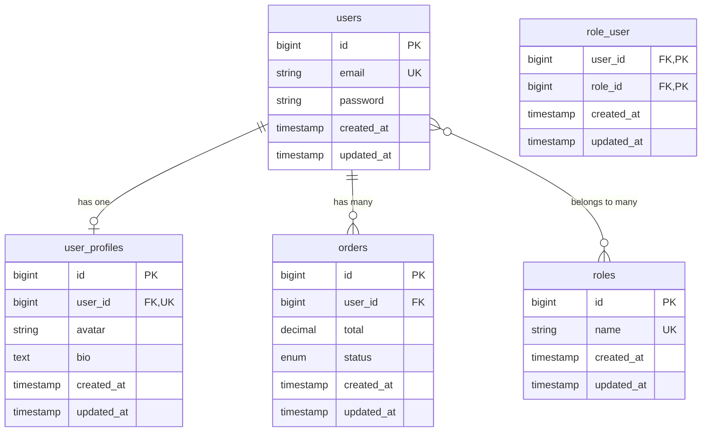
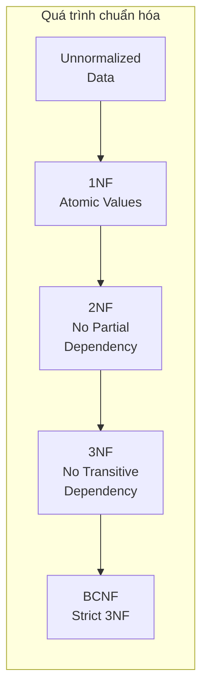
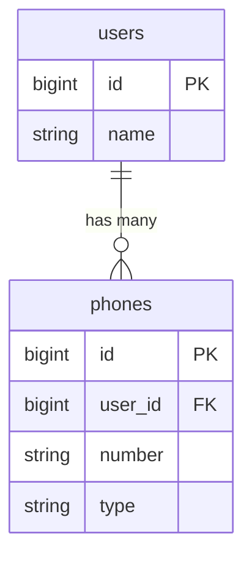
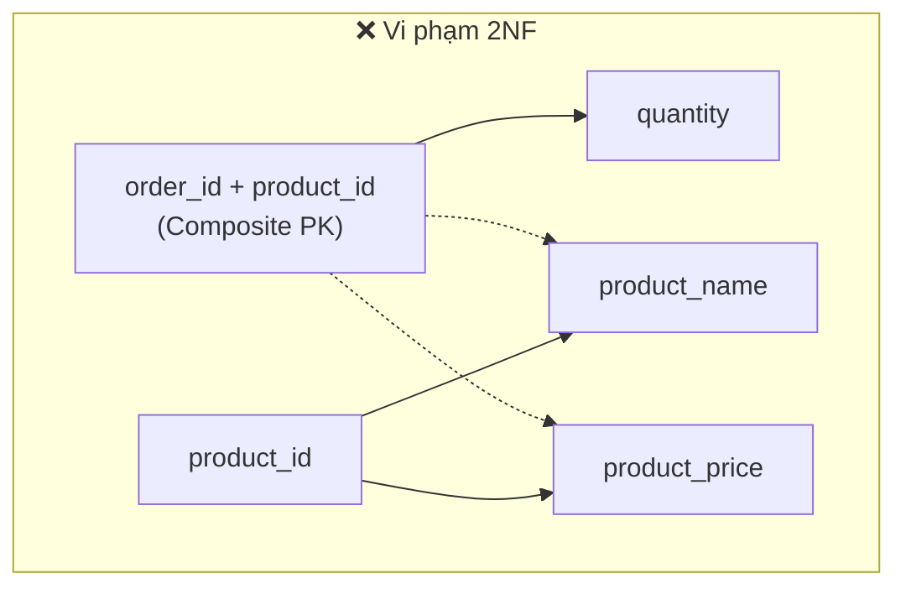
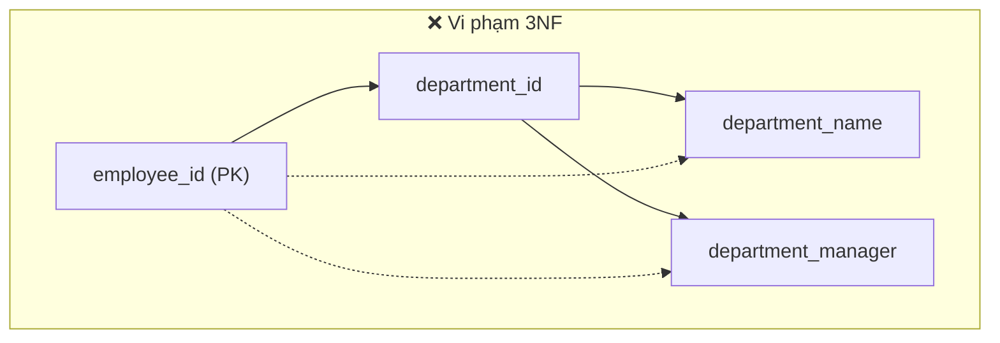
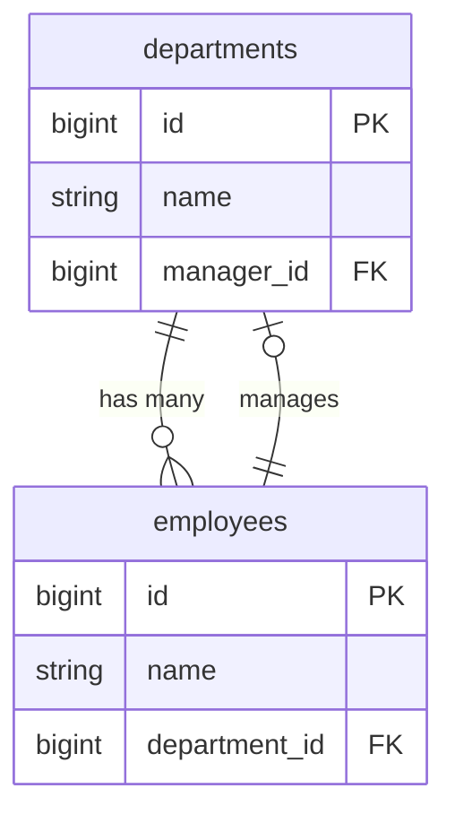
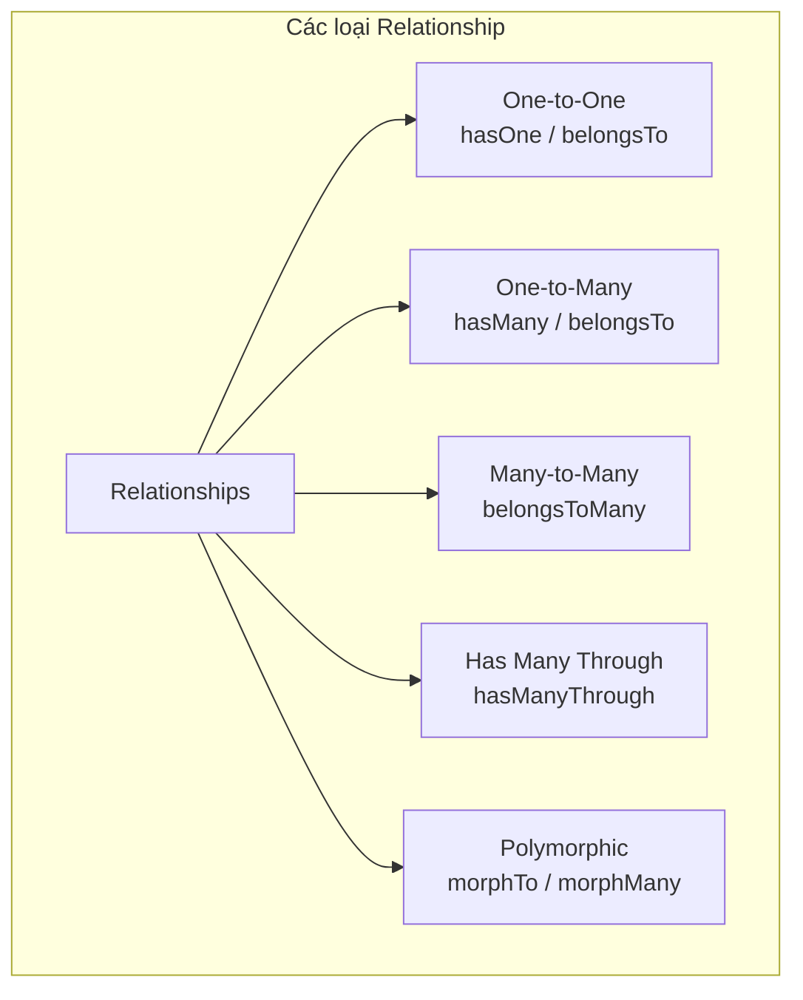
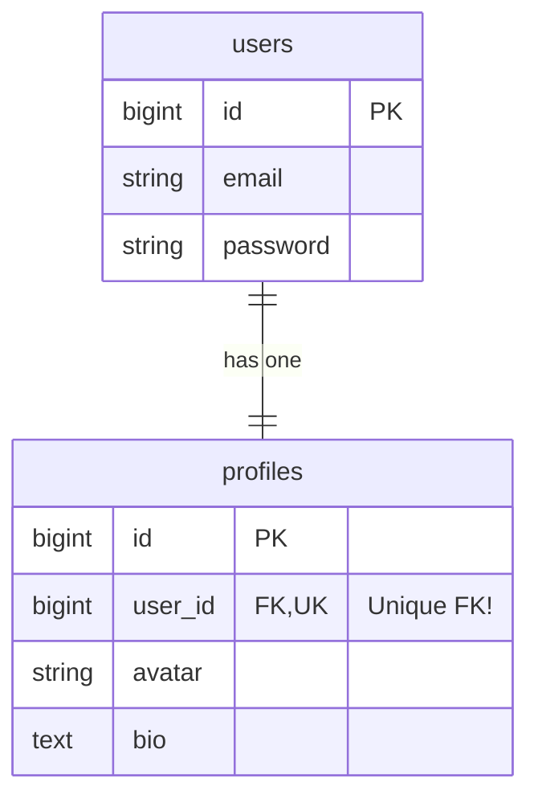
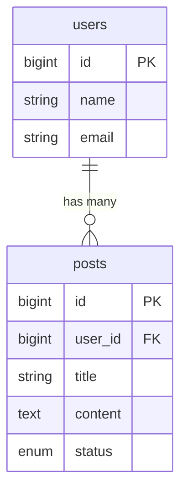
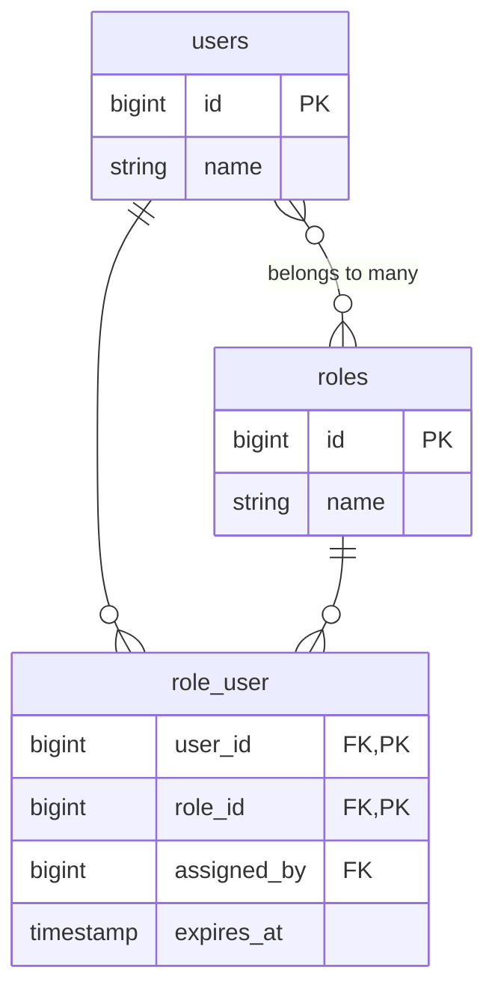

# Thiết Kế Cơ Sở Dữ Liệu Nâng Cao Trong Laravel

> Tài liệu hướng dẫn toàn diện về thiết kế và triển khai cơ sở dữ liệu trong Laravel

---

## Mục Lục

1. [Nguyên Tắc Thiết Kế Cơ Sở Dữ Liệu](#1-nguyên-tắc-thiết-kế-cơ-sở-dữ-liệu)
2. [Chuẩn Hóa Dữ Liệu (Normalization)](#2-chuẩn-hóa-dữ-liệu-normalization)
3. [Migration Nâng Cao](#3-migration-nâng-cao)
4. [Eloquent Relationships](#4-eloquent-relationships)
5. [Query Optimization](#5-query-optimization)
6. [Indexing Strategies](#6-indexing-strategies)
7. [Database Transactions](#7-database-transactions)
8. [Soft Deletes & Data Archiving](#8-soft-deletes--data-archiving)
9. [Database Seeding & Factories](#9-database-seeding--factories)
10. [Multi-tenancy Patterns](#10-multi-tenancy-patterns)
11. [Best Practices & Anti-patterns](#11-best-practices--anti-patterns)

---

## 1. Nguyên Tắc Thiết Kế Cơ Sở Dữ Liệu

### 1.1 ACID Properties

ACID là bốn thuộc tính quan trọng đảm bảo tính toàn vẹn của dữ liệu trong các hệ quản trị cơ sở dữ liệu:

#### Atomicity (Tính nguyên tử)

**Định nghĩa**: Một transaction phải được thực hiện hoàn toàn hoặc không thực hiện gì cả. Không có trạng thái "nửa vời".

**Ví dụ thực tế**: Khi chuyển tiền từ tài khoản A sang B:
- Trừ tiền từ A
- Cộng tiền vào B

Nếu bước 2 thất bại, bước 1 cũng phải được hoàn tác (rollback).

```php
DB::transaction(function () {
    $accountA = Account::find(1);
    $accountB = Account::find(2);
    
    $accountA->balance -= 1000;  // Bước 1
    $accountA->save();
    
    $accountB->balance += 1000;  // Bước 2
    $accountB->save();
    // Nếu có lỗi ở đây, cả 2 bước đều rollback
});
```

#### Consistency (Tính nhất quán)

**Định nghĩa**: Database luôn chuyển từ trạng thái hợp lệ này sang trạng thái hợp lệ khác. Mọi ràng buộc (constraints) phải được thỏa mãn.

**Ví dụ thực tế**: Foreign key constraint đảm bảo rằng `user_id` trong bảng `posts` luôn tham chiếu đến một user thực sự tồn tại.

```php
// Database sẽ từ chối nếu user_id = 999 không tồn tại
$table->foreignId('user_id')->constrained(); // Tự động tạo FK constraint
```

#### Isolation (Tính cô lập)

**Định nghĩa**: Các transaction chạy đồng thời không ảnh hưởng lẫn nhau. Mỗi transaction "nhìn thấy" database như thể nó là transaction duy nhất đang chạy.

**Vấn đề có thể xảy ra nếu không có Isolation**:

| Vấn đề | Mô tả |
|--------|-------|
| **Dirty Read** | Đọc dữ liệu chưa được commit từ transaction khác |
| **Non-repeatable Read** | Đọc cùng một row 2 lần nhưng ra kết quả khác nhau |
| **Phantom Read** | Query 2 lần nhưng số lượng rows thay đổi |

```php
// Sử dụng lock để đảm bảo isolation
$user = User::where('id', 1)->lockForUpdate()->first();
```

#### Durability (Tính bền vững)

**Định nghĩa**: Sau khi transaction được commit thành công, dữ liệu được lưu trữ vĩnh viễn, ngay cả khi hệ thống gặp sự cố (mất điện, crash).

**Cơ chế đảm bảo**:
- Write-Ahead Logging (WAL)
- Transaction logs
- Checkpoint mechanisms

### 1.2 Quy Tắc Đặt Tên

Laravel có những quy ước đặt tên nghiêm ngặt. Tuân thủ sẽ giúp Eloquent hoạt động tự động mà không cần cấu hình thêm.

| Thành phần | Quy ước | Ví dụ |
|------------|---------|-------|
| Tên bảng | snake_case, số nhiều | `users`, `blog_posts` |
| Model | PascalCase, số ít | `User`, `BlogPost` |
| Foreign Key | singular_id | `user_id`, `blog_post_id` |
| Pivot Table | singular_singular (alphabet) | `post_tag`, `role_user` |
| Primary Key | `id` | `$table->id()` |
| Timestamps | `created_at`, `updated_at` | `$table->timestamps()` |

```php
// ✅ Tốt - Laravel tự động hiểu
class User extends Model {}           // Tự động map đến bảng 'users'
class BlogPost extends Model {}       // Tự động map đến bảng 'blog_posts'

// ❌ Không tốt - Phải cấu hình thủ công
class User extends Model {
    protected $table = 'tbl_users';   // Phải khai báo tên bảng
}
```

### 1.3 Thiết Kế Entity-Relationship (ER)

ER Diagram thể hiện mối quan hệ giữa các entity (bảng) trong database:



**Giải thích ký hiệu**:
- `||--o|`: One-to-One (một user có một profile)
- `||--o{`: One-to-Many (một user có nhiều orders)
- `}o--o{`: Many-to-Many (users và roles qua pivot table)
- `PK`: Primary Key
- `FK`: Foreign Key
- `UK`: Unique Key

---

## 2. Chuẩn Hóa Dữ Liệu (Normalization)

Chuẩn hóa là quá trình tổ chức dữ liệu trong database nhằm:
- **Giảm dư thừa dữ liệu** (data redundancy)
- **Tránh anomalies** khi thêm/sửa/xóa dữ liệu
- **Đảm bảo tính toàn vẹn** của dữ liệu



### 2.1 Các Dạng Chuẩn Hóa

#### First Normal Form (1NF)

**Quy tắc**:
1. Mỗi cột chứa giá trị **atomic** (không thể chia nhỏ hơn)
2. Không có **nhóm lặp lại** (repeating groups)
3. Mỗi row phải **duy nhất** (có primary key)

**Ví dụ vi phạm 1NF**:

| user_id | name | phones |
|---------|------|--------|
| 1 | John | 0123, 0456, 0789 |

→ Cột `phones` chứa nhiều giá trị (không atomic)

```php
// ❌ Vi phạm 1NF - Lưu nhiều số phone trong 1 cột
Schema::create('users', function (Blueprint $table) {
    $table->id();
    $table->string('name');
    $table->string('phones');  // "0123,0456,0789" - BAD!
});

// ✅ Tuân thủ 1NF - Tách thành bảng riêng
Schema::create('users', function (Blueprint $table) {
    $table->id();
    $table->string('name');
});

Schema::create('phones', function (Blueprint $table) {
    $table->id();
    $table->foreignId('user_id')->constrained()->cascadeOnDelete();
    $table->string('number');  // Mỗi row = 1 số phone
    $table->string('type')->default('mobile'); // home, work, mobile
});
```

**Mối quan hệ sau khi chuẩn hóa**:



#### Second Normal Form (2NF)

**Quy tắc**:
1. Thỏa mãn 1NF
2. Không có **phụ thuộc hàm bộ phận** (partial dependency) - tất cả các cột không phải khóa phải phụ thuộc vào **toàn bộ** primary key

**Giải thích**: Nếu bảng có composite primary key (nhiều cột), mỗi cột dữ liệu phải phụ thuộc vào TẤT CẢ cột của primary key, không chỉ một phần.



→ `product_name` và `product_price` chỉ phụ thuộc vào `product_id`, không phụ thuộc vào `order_id`

```php
// ❌ Vi phạm 2NF - Các cột chỉ phụ thuộc vào một phần của composite key
Schema::create('order_items', function (Blueprint $table) {
    $table->foreignId('order_id');                  // Phần 1 của PK
    $table->foreignId('product_id');                // Phần 2 của PK
    $table->string('product_name');                 // Chỉ phụ thuộc product_id!
    $table->decimal('product_price', 10, 2);        // Chỉ phụ thuộc product_id!
    $table->integer('quantity');                    // Phụ thuộc cả 2 (OK)
    $table->primary(['order_id', 'product_id']);
});

// ✅ Tuân thủ 2NF - Tách thông tin product ra bảng riêng
Schema::create('products', function (Blueprint $table) {
    $table->id();
    $table->string('name');
    $table->decimal('price', 10, 2);
});

Schema::create('order_items', function (Blueprint $table) {
    $table->id();
    $table->foreignId('order_id')->constrained();
    $table->foreignId('product_id')->constrained();
    $table->integer('quantity');
    // Lưu giá tại thời điểm mua (snapshot) - phụ thuộc vào order+product
    $table->decimal('unit_price', 10, 2);
});
```

> [!NOTE]
> `unit_price` trong `order_items` không vi phạm 2NF vì nó là **snapshot** giá tại thời điểm mua, khác với giá hiện tại trong bảng `products`.

#### Third Normal Form (3NF)

**Quy tắc**:
1. Thỏa mãn 2NF
2. Không có **phụ thuộc bắc cầu** (transitive dependency) - các cột không phải khóa không được phụ thuộc vào cột không phải khóa khác

**Giải thích**: Nếu A → B và B → C, thì A → C là phụ thuộc bắc cầu. Phải tách B và C ra bảng riêng.



→ `department_name` phụ thuộc vào `department_id`, không trực tiếp vào `employee_id`

```php
// ❌ Vi phạm 3NF - Phụ thuộc bắc cầu
Schema::create('employees', function (Blueprint $table) {
    $table->id();                           // PK
    $table->string('name');
    $table->foreignId('department_id');     // Non-key
    $table->string('department_name');      // Phụ thuộc department_id!
    $table->string('department_manager');   // Phụ thuộc department_id!
});

// ✅ Tuân thủ 3NF - Tách department thành bảng riêng
Schema::create('departments', function (Blueprint $table) {
    $table->id();
    $table->string('name');
    $table->foreignId('manager_id')->nullable()->constrained('employees');
});

Schema::create('employees', function (Blueprint $table) {
    $table->id();
    $table->string('name');
    $table->foreignId('department_id')->constrained();
    // Không còn department_name, department_manager ở đây
});
```

**Mối quan hệ sau khi chuẩn hóa**:



### 2.2 Khi Nào Nên Denormalize

**Denormalization** là quá trình cố ý vi phạm các quy tắc chuẩn hóa để cải thiện hiệu suất đọc.

> [!TIP]
> Denormalization phù hợp khi cần tối ưu hiệu suất đọc dữ liệu, đặc biệt cho reporting/analytics.

| Nên Denormalize | Không Nên Denormalize |
|------------------|------------------------|
| Reporting tables | Transactional tables |
| Read-heavy systems | Write-heavy systems |
| Caching layers | Core business data |
| Archived data | Frequently updated data |

```php
// Denormalize cho reporting/analytics
Schema::create('order_summaries', function (Blueprint $table) {
    $table->id();
    $table->foreignId('order_id')->constrained();
    // Dữ liệu denormalized - không cần JOIN khi query
    $table->string('customer_name');        // Từ users table
    $table->string('customer_email');       // Từ users table
    $table->decimal('total_amount', 12, 2); // Tính sẵn
    $table->integer('total_items');         // Tính sẵn
    $table->timestamp('order_date');
    
    // Index cho queries nhanh
    $table->index(['order_date', 'customer_email']);
});
```

**Cách duy trì dữ liệu denormalized**:

```php
// Sử dụng Observer hoặc Event Listener
class OrderObserver
{
    public function created(Order $order): void
    {
        OrderSummary::create([
            'order_id' => $order->id,
            'customer_name' => $order->user->name,
            'customer_email' => $order->user->email,
            'total_amount' => $order->items->sum('subtotal'),
            'total_items' => $order->items->count(),
            'order_date' => $order->created_at,
        ]);
    }
}
```

---

## 3. Migration Nâng Cao

### 3.1 Cấu Trúc Migration Chuẩn

```php
<?php

use Illuminate\Database\Migrations\Migration;
use Illuminate\Database\Schema\Blueprint;
use Illuminate\Support\Facades\Schema;

return new class extends Migration
{
    /**
     * Run the migrations.
     */
    public function up(): void
    {
        Schema::create('products', function (Blueprint $table) {
            // Primary Key
            $table->id();
            
            // UUIDs (nếu cần)
            // $table->uuid('uuid')->unique();
            
            // Các cột dữ liệu
            $table->string('name', 255);
            $table->text('description')->nullable();
            $table->decimal('price', 10, 2);
            $table->integer('stock')->default(0);
            $table->enum('status', ['draft', 'published', 'archived'])->default('draft');
            
            // JSON columns
            $table->json('metadata')->nullable();
            
            // Foreign Keys
            $table->foreignId('category_id')
                ->constrained()
                ->cascadeOnUpdate()
                ->restrictOnDelete();
            
            // Polymorphic Relations
            $table->nullableMorphs('taggable');
            
            // Timestamps
            $table->timestamps();
            $table->softDeletes();
            
            // Indexes
            $table->index(['status', 'created_at']);
            $table->fullText('name');
        });
    }

    /**
     * Reverse the migrations.
     */
    public function down(): void
    {
        Schema::dropIfExists('products');
    }
};
```

### 3.2 Thay Đổi Cột An Toàn

```php
// Cài đặt doctrine/dbal để modify columns
// composer require doctrine/dbal

public function up(): void
{
    Schema::table('users', function (Blueprint $table) {
        // Thay đổi kiểu dữ liệu
        $table->string('name', 500)->change();
        
        // Thêm giá trị mặc định
        $table->string('status')->default('active')->change();
        
        // Cho phép null
        $table->string('phone')->nullable()->change();
        
        // Đổi tên cột
        $table->renameColumn('old_name', 'new_name');
    });
}
```

### 3.3 Migration cho Big Tables

```php
use Illuminate\Support\Facades\DB;

public function up(): void
{
    // Sử dụng raw SQL cho bảng lớn để tránh lock
    DB::statement('ALTER TABLE users ADD COLUMN new_field VARCHAR(255) NULL');
    
    // Hoặc sử dụng pt-online-schema-change (Production)
    // pt-online-schema-change --alter "ADD COLUMN new_field VARCHAR(255)" D=database,t=users
}
```

### 3.4 Composite Primary Keys

```php
Schema::create('order_items', function (Blueprint $table) {
    $table->foreignId('order_id')->constrained();
    $table->foreignId('product_id')->constrained();
    $table->integer('quantity');
    
    // Composite Primary Key
    $table->primary(['order_id', 'product_id']);
});
```

---

## 4. Eloquent Relationships

Eloquent cung cấp các phương thức để định nghĩa và làm việc với các mối quan hệ giữa các bảng. Hiểu rõ từng loại relationship rất quan trọng:



### 4.1 One-to-One (Một - Một)

**Khi nào sử dụng**: Khi một record trong bảng A chỉ liên kết với đúng một record trong bảng B và ngược lại.

**Ví dụ thực tế**: User ↔ Profile, Country ↔ Capital



> [!IMPORTANT]
> Trong One-to-One, foreign key phải có constraint **UNIQUE** để đảm bảo mỗi user chỉ có một profile.

```php
// User Model - "Parent" có hasOne
class User extends Model
{
    /**
     * hasOne: User "đang có" một Profile
     * Laravel tìm profiles.user_id = users.id
     */
    public function profile(): HasOne
    {
        return $this->hasOne(Profile::class);
        // Tương đương: Profile::where('user_id', $this->id)->first()
    }
}

// Profile Model - "Child" có belongsTo
class Profile extends Model
{
    /**
     * belongsTo: Profile "thuộc về" một User
     * Laravel tìm users.id = profiles.user_id
     */
    public function user(): BelongsTo
    {
        return $this->belongsTo(User::class);
        // Tương đương: User::find($this->user_id)
    }
}

// Migration - Lưu ý UNIQUE constraint
Schema::create('profiles', function (Blueprint $table) {
    $table->id();
    // UNIQUE: Đảm bảo mỗi user chỉ có 1 profile
    $table->foreignId('user_id')->unique()->constrained()->cascadeOnDelete();
    $table->string('avatar')->nullable();
    $table->text('bio')->nullable();
    $table->timestamps();
});

// Sử dụng
$user->profile;                    // Lấy profile của user
$user->profile()->create([...]);   // Tạo profile cho user
$profile->user;                    // Lấy user của profile
```

### 4.2 One-to-Many (Một - Nhiều)

**Khi nào sử dụng**: Khi một record trong bảng A có thể liên kết với nhiều records trong bảng B.

**Ví dụ thực tế**: User → Posts, Category → Products, Department → Employees



```php
// User Model - "Parent" có hasMany
class User extends Model
{
    /**
     * hasMany: User có nhiều Posts
     * Laravel tìm posts.user_id = users.id
     */
    public function posts(): HasMany
    {
        return $this->hasMany(Post::class);
    }
    
    // Với constraints - Lọc theo điều kiện
    public function publishedPosts(): HasMany
    {
        return $this->hasMany(Post::class)->where('status', 'published');
    }
    
    // Lấy posts mới nhất
    public function latestPosts(): HasMany
    {
        return $this->hasMany(Post::class)->latest()->limit(5);
    }
}

// Post Model - "Child" có belongsTo
class Post extends Model
{
    public function user(): BelongsTo
    {
        return $this->belongsTo(User::class);
    }
    
    // Với default value - Trả về giá trị mặc định nếu user không tồn tại
    public function author(): BelongsTo
    {
        return $this->belongsTo(User::class, 'user_id')->withDefault([
            'name' => 'Anonymous',
        ]);
    }
}

// Sử dụng
$user->posts;                           // Collection của tất cả posts
$user->posts()->create([...]);          // Tạo post mới cho user
$user->posts()->where('status', 'draft')->get(); // Query thêm
$post->user;                            // Lấy user của post
```

### 4.3 Many-to-Many (Nhiều - Nhiều)

**Khi nào sử dụng**: Khi một record trong bảng A có thể liên kết với nhiều records trong bảng B, và ngược lại.

**Ví dụ thực tế**: Users ↔ Roles, Posts ↔ Tags, Students ↔ Courses

> [!NOTE]
> Many-to-Many cần một **pivot table** (đôi khi gọi là junction table, intermediate table) để lưu mối quan hệ.



```php
// User Model
class User extends Model
{
    /**
     * belongsToMany: User thuộc về nhiều Roles (và ngược lại)
     * Laravel tìm qua pivot table role_user
     */
    public function roles(): BelongsToMany
    {
        return $this->belongsToMany(Role::class)
            ->withPivot('assigned_by', 'expires_at')  // Lấy thêm cột từ pivot
            ->withTimestamps()                        // Tự động quản lý timestamps
            ->as('assignment');                       // Đổi tên pivot accessor
    }
}

// Role Model
class Role extends Model
{
    public function users(): BelongsToMany
    {
        return $this->belongsToMany(User::class)
            ->withTimestamps();
    }
}

// Migration - Pivot Table
Schema::create('role_user', function (Blueprint $table) {
    // Tên bảng: singular_singular theo thứ tự alphabet (role < user)
    $table->foreignId('role_id')->constrained()->cascadeOnDelete();
    $table->foreignId('user_id')->constrained()->cascadeOnDelete();
    
    // Dữ liệu thêm trong pivot (optional)
    $table->foreignId('assigned_by')->nullable()->constrained('users');
    $table->timestamp('expires_at')->nullable();
    $table->timestamps();
    
    // Composite Primary Key - Đảm bảo không trùng lặp
    $table->primary(['role_id', 'user_id']);
});
```

**Các phương thức làm việc với pivot**:

```php
// Gắn role vào user (INSERT vào pivot)
$user->roles()->attach($roleId);
$user->roles()->attach($roleId, [
    'assigned_by' => auth()->id(),
    'expires_at' => now()->addYear(),
]);
$user->roles()->attach([1, 2, 3]);  // Gắn nhiều roles

// Gỡ role khỏi user (DELETE từ pivot)
$user->roles()->detach($roleId);
$user->roles()->detach([1, 2, 3]);
$user->roles()->detach();           // Gỡ tất cả

// Đồng bộ - Giữ lại chỉ các roles được chỉ định
$user->roles()->sync([1, 2, 3]);    // Xoá các roles khác 1,2,3
$user->roles()->sync([1 => ['expires_at' => now()], 2, 3]);

// Đồng bộ mà không gỡ bỏ roles hiện có
$user->roles()->syncWithoutDetaching([1, 2]);

// Toggle - Gắn nếu chưa có, gỡ nếu đã có
$user->roles()->toggle([1, 2, 3]);

// Cập nhật pivot data
$user->roles()->updateExistingPivot($roleId, [
    'expires_at' => now()->addMonth(),
]);

// Truy cập pivot data
foreach ($user->roles as $role) {
    echo $role->assignment->expires_at;  // Sử dụng alias 'assignment'
    echo $role->pivot->assigned_by;      // Hoặc trực tiếp qua pivot
}
```

### 4.4 Has Many Through

```php
// Country -> Users -> Posts
class Country extends Model
{
    public function posts(): HasManyThrough
    {
        return $this->hasManyThrough(
            Post::class,      // Final model
            User::class,      // Intermediate model
            'country_id',     // FK on users table
            'user_id',        // FK on posts table
            'id',             // Local key on countries
            'id'              // Local key on users
        );
    }
}
```

### 4.5 Polymorphic Relationships

```php
// One-to-Many Polymorphic
// comments có thể thuộc về posts hoặc videos

class Comment extends Model
{
    public function commentable(): MorphTo
    {
        return $this->morphTo();
    }
}

class Post extends Model
{
    public function comments(): MorphMany
    {
        return $this->morphMany(Comment::class, 'commentable');
    }
}

class Video extends Model
{
    public function comments(): MorphMany
    {
        return $this->morphMany(Comment::class, 'commentable');
    }
}

// Migration
Schema::create('comments', function (Blueprint $table) {
    $table->id();
    $table->text('body');
    $table->morphs('commentable'); // commentable_type, commentable_id
    $table->timestamps();
});
```

```php
// Many-to-Many Polymorphic
// Tags có thể gắn với posts và videos

class Tag extends Model
{
    public function posts(): MorphToMany
    {
        return $this->morphedByMany(Post::class, 'taggable');
    }
    
    public function videos(): MorphToMany
    {
        return $this->morphedByMany(Video::class, 'taggable');
    }
}

class Post extends Model
{
    public function tags(): MorphToMany
    {
        return $this->morphToMany(Tag::class, 'taggable');
    }
}

// Migration - Pivot Table
Schema::create('taggables', function (Blueprint $table) {
    $table->foreignId('tag_id')->constrained()->cascadeOnDelete();
    $table->morphs('taggable');
    
    $table->primary(['tag_id', 'taggable_id', 'taggable_type']);
});
```

---

## 5. Query Optimization

### 5.1 Eager Loading

```php
// ❌ N+1 Problem
$posts = Post::all();
foreach ($posts as $post) {
    echo $post->author->name;  // Query cho mỗi post
}

// ✅ Eager Loading
$posts = Post::with('author')->get();

// ✅ Nested Eager Loading
$posts = Post::with('author.profile', 'comments.user')->get();

// ✅ Constrained Eager Loading
$posts = Post::with([
    'comments' => function ($query) {
        $query->where('approved', true)
              ->orderBy('created_at', 'desc')
              ->limit(5);
    }
])->get();

// ✅ Eager Loading với Select (tối ưu memory)
$posts = Post::with(['author:id,name,email'])->get();
```

### 5.2 Lazy Eager Loading

```php
$posts = Post::all();

// Lazy load khi cần
if ($needComments) {
    $posts->load('comments');
}

// Load nếu chưa load
$posts->loadMissing('author');
```

### 5.3 Query Builder Optimization

```php
// ✅ Select only needed columns
$users = User::select('id', 'name', 'email')->get();

// ✅ Chunk for large datasets
User::chunk(1000, function ($users) {
    foreach ($users as $user) {
        // Process user
    }
});

// ✅ Lazy Collection (memory efficient)
User::lazy()->each(function ($user) {
    // Process user
});

// ✅ Cursor (most memory efficient)
foreach (User::cursor() as $user) {
    // Process user
}

// ✅ Use exists() instead of count()
if (User::where('email', $email)->exists()) {
    // ...
}

// ✅ Aggregate functions
$total = Order::where('status', 'completed')->sum('amount');

// ✅ Subqueries
$users = User::addSelect([
    'last_order_date' => Order::select('created_at')
        ->whereColumn('user_id', 'users.id')
        ->latest()
        ->limit(1)
])->get();
```

### 5.4 Raw Queries (Khi Cần Thiết)

```php
// Raw Select
$users = User::selectRaw('YEAR(created_at) as year, COUNT(*) as count')
    ->groupByRaw('YEAR(created_at)')
    ->get();

// Raw Where
$orders = Order::whereRaw('price > IF(discount > 0, price * 0.9, price * 0.8)')
    ->get();

// Raw Order
$posts = Post::orderByRaw('FIELD(status, "published", "draft", "archived")')
    ->get();
```

---

## 6. Indexing Strategies

### 6.1 Các Loại Index

```php
Schema::create('products', function (Blueprint $table) {
    $table->id();
    $table->string('sku');
    $table->string('name');
    $table->text('description');
    $table->decimal('price', 10, 2);
    $table->foreignId('category_id');
    $table->enum('status', ['active', 'inactive']);
    $table->timestamps();
    
    // Unique Index
    $table->unique('sku');
    
    // Regular Index
    $table->index('price');
    
    // Composite Index (thứ tự quan trọng!)
    $table->index(['category_id', 'status', 'price']);
    
    // Full-text Index (MySQL/PostgreSQL)
    $table->fullText(['name', 'description']);
});
```

### 6.2 Khi Nào Nên Đánh Index

> [!IMPORTANT]
> Index tăng tốc độ đọc nhưng làm chậm ghi dữ liệu

| Nên Index | Không Nên Index |
|-----------|-----------------|
| Cột trong WHERE clause | Cột hiếm khi query |
| Cột trong JOIN | Bảng nhỏ (< 1000 rows) |
| Cột trong ORDER BY | Cột có nhiều NULL |
| Foreign Keys | Cột thường xuyên update |
| Cột có cardinality cao | Cột có cardinality thấp (boolean) |

### 6.3 Composite Index Best Practices

```php
// Query pattern: WHERE category_id = ? AND status = ? ORDER BY price
// Index nên theo thứ tự: category_id, status, price

$table->index(['category_id', 'status', 'price']);

// ✅ Sử dụng được index
Product::where('category_id', 1)->get();
Product::where('category_id', 1)->where('status', 'active')->get();
Product::where('category_id', 1)->where('status', 'active')->orderBy('price')->get();

// ❌ Không sử dụng được index (bỏ qua cột đầu tiên)
Product::where('status', 'active')->get();
Product::where('price', '>', 100)->get();
```

### 6.4 Analyze Query với EXPLAIN

```php
// Trong Tinker hoặc code
DB::enableQueryLog();
Product::where('category_id', 1)->get();
dd(DB::getQueryLog());

// Sử dụng EXPLAIN
DB::select('EXPLAIN SELECT * FROM products WHERE category_id = 1');

// Laravel Debugbar (development)
// composer require barryvdh/laravel-debugbar --dev
```

---

## 7. Database Transactions

### 7.1 Basic Transactions

```php
use Illuminate\Support\Facades\DB;

// Closure-based (tự động commit/rollback)
DB::transaction(function () {
    $user = User::create([...]);
    $user->profile()->create([...]);
    $user->roles()->attach([1, 2, 3]);
});

// Với retry attempts
DB::transaction(function () {
    // ...
}, 5);  // Retry 5 lần nếu deadlock
```

### 7.2 Manual Transactions

```php
DB::beginTransaction();

try {
    $user = User::create([...]);
    $wallet = Wallet::create(['user_id' => $user->id, 'balance' => 0]);
    
    if ($someCondition) {
        throw new Exception('Something went wrong');
    }
    
    DB::commit();
} catch (Exception $e) {
    DB::rollBack();
    throw $e;
}
```

### 7.3 Savepoints (Nested Transactions)

```php
DB::transaction(function () {
    User::create(['name' => 'User 1']);
    
    // Nested transaction (savepoint)
    DB::transaction(function () {
        User::create(['name' => 'User 2']);
        
        if ($error) {
            throw new Exception('Rollback to savepoint');
        }
    });
    
    User::create(['name' => 'User 3']);
});
```

### 7.4 Isolation Levels

```php
// MySQL Isolation Levels:
// - READ UNCOMMITTED: Dirty reads possible
// - READ COMMITTED: Non-repeatable reads possible
// - REPEATABLE READ (default): Phantom reads possible
// - SERIALIZABLE: Strictest, slowest

DB::statement('SET TRANSACTION ISOLATION LEVEL SERIALIZABLE');
DB::transaction(function () {
    // Critical financial transaction
});
```

### 7.5 Pessimistic Locking

```php
// Lock for update (SELECT ... FOR UPDATE)
$user = User::where('id', 1)->lockForUpdate()->first();
$user->balance -= 100;
$user->save();

// Shared lock (SELECT ... LOCK IN SHARE MODE)
$user = User::where('id', 1)->sharedLock()->first();
```

---

## 8. Soft Deletes & Data Archiving

### 8.1 Soft Deletes

```php
// Migration
Schema::table('posts', function (Blueprint $table) {
    $table->softDeletes();  // Thêm cột deleted_at
});

// Model
use Illuminate\Database\Eloquent\SoftDeletes;

class Post extends Model
{
    use SoftDeletes;
    
    protected $casts = [
        'deleted_at' => 'datetime',
    ];
}

// Sử dụng
$post->delete();              // Soft delete
$post->forceDelete();         // Permanent delete
$post->restore();             // Restore

// Query
Post::withTrashed()->get();   // Bao gồm soft deleted
Post::onlyTrashed()->get();   // Chỉ soft deleted
```

### 8.2 Cascade Soft Deletes

```php
// composer require askedio/laravel-soft-cascade

use Askedio\SoftCascade\Traits\SoftCascadeTrait;

class User extends Model
{
    use SoftDeletes, SoftCascadeTrait;
    
    protected $softCascade = ['posts', 'comments'];
}
```

### 8.3 Data Archiving Strategy

```php
// Tạo bảng archive
Schema::create('orders_archive', function (Blueprint $table) {
    $table->id();
    $table->json('data');
    $table->timestamps();
    $table->index('created_at');
});

// Artisan Command để archive dữ liệu cũ
class ArchiveOldOrders extends Command
{
    protected $signature = 'orders:archive {--months=12}';
    
    public function handle()
    {
        $months = $this->option('months');
        $cutoff = now()->subMonths($months);
        
        DB::transaction(function () use ($cutoff) {
            Order::where('created_at', '<', $cutoff)
                ->chunk(1000, function ($orders) {
                    foreach ($orders as $order) {
                        OrderArchive::create([
                            'data' => $order->toArray(),
                        ]);
                        $order->forceDelete();
                    }
                });
        });
    }
}
```

---

## 9. Database Seeding & Factories

### 9.1 Model Factories

```php
// database/factories/UserFactory.php
class UserFactory extends Factory
{
    protected $model = User::class;
    
    public function definition(): array
    {
        return [
            'name' => fake()->name(),
            'email' => fake()->unique()->safeEmail(),
            'email_verified_at' => now(),
            'password' => Hash::make('password'),
            'remember_token' => Str::random(10),
        ];
    }
    
    // States
    public function unverified(): static
    {
        return $this->state(fn (array $attributes) => [
            'email_verified_at' => null,
        ]);
    }
    
    public function admin(): static
    {
        return $this->state(fn (array $attributes) => [
            'role' => 'admin',
        ]);
    }
    
    // Callbacks
    public function configure(): static
    {
        return $this->afterCreating(function (User $user) {
            $user->profile()->create([
                'bio' => fake()->paragraph(),
            ]);
        });
    }
}
```

### 9.2 Relationship Factories

```php
// Tạo user với posts
$user = User::factory()
    ->has(Post::factory()->count(3))
    ->create();

// Shorthand
$user = User::factory()
    ->hasPosts(3)
    ->create();

// Với custom attributes
$user = User::factory()
    ->has(
        Post::factory()
            ->count(3)
            ->state(['status' => 'published'])
    )
    ->create();

// belongsTo
$posts = Post::factory()
    ->count(3)
    ->for(User::factory()->state(['name' => 'John']))
    ->create();

// Many-to-Many
$user = User::factory()
    ->hasAttached(
        Role::factory()->count(3),
        ['assigned_by' => 1]
    )
    ->create();
```

### 9.3 Database Seeders

```php
// database/seeders/DatabaseSeeder.php
class DatabaseSeeder extends Seeder
{
    public function run(): void
    {
        // Chạy theo thứ tự dependencies
        $this->call([
            RoleSeeder::class,
            UserSeeder::class,
            CategorySeeder::class,
            ProductSeeder::class,
        ]);
    }
}

// database/seeders/UserSeeder.php
class UserSeeder extends Seeder
{
    public function run(): void
    {
        // Admin user
        $admin = User::factory()
            ->admin()
            ->create([
                'email' => 'admin@example.com',
            ]);
        
        // Regular users với posts
        User::factory()
            ->count(10)
            ->hasPosts(5)
            ->create();
    }
}
```

### 9.4 Seeding Best Practices

```php
// Sử dụng truncate cẩn thận
class ProductSeeder extends Seeder
{
    public function run(): void
    {
        // Disable foreign key checks
        Schema::disableForeignKeyConstraints();
        Product::truncate();
        Schema::enableForeignKeyConstraints();
        
        // Seed data
        Product::factory()->count(100)->create();
    }
}

// Environment-specific seeding
class DatabaseSeeder extends Seeder
{
    public function run(): void
    {
        if (app()->environment('local', 'testing')) {
            $this->call(DevelopmentSeeder::class);
        }
        
        // Always run these
        $this->call(RoleSeeder::class);
    }
}
```

---

## 10. Multi-tenancy Patterns

### 10.1 Single Database - Tenant Column

```php
// Migration
Schema::create('posts', function (Blueprint $table) {
    $table->id();
    $table->foreignId('tenant_id')->constrained()->index();
    $table->string('title');
    $table->timestamps();
});

// Model với Global Scope
class Post extends Model
{
    protected static function booted(): void
    {
        static::addGlobalScope('tenant', function (Builder $builder) {
            if (auth()->check()) {
                $builder->where('tenant_id', auth()->user()->tenant_id);
            }
        });
        
        static::creating(function (Post $post) {
            $post->tenant_id = auth()->user()->tenant_id;
        });
    }
}

// Trait cho reusability
trait BelongsToTenant
{
    protected static function bootBelongsToTenant(): void
    {
        static::addGlobalScope(new TenantScope);
        
        static::creating(function ($model) {
            if (auth()->check()) {
                $model->tenant_id = auth()->user()->tenant_id;
            }
        });
    }
    
    public function tenant(): BelongsTo
    {
        return $this->belongsTo(Tenant::class);
    }
}
```

### 10.2 Database Per Tenant

```php
// config/database.php
'connections' => [
    'tenant' => [
        'driver' => 'mysql',
        'host' => env('DB_HOST'),
        'database' => '', // Set dynamically
        'username' => env('DB_USERNAME'),
        'password' => env('DB_PASSWORD'),
    ],
],

// Middleware để switch database
class SetTenantDatabase
{
    public function handle(Request $request, Closure $next)
    {
        $tenant = $this->resolveTenant($request);
        
        Config::set('database.connections.tenant.database', $tenant->database);
        DB::reconnect('tenant');
        
        return $next($request);
    }
}

// Model sử dụng tenant connection
class TenantModel extends Model
{
    protected $connection = 'tenant';
}
```

### 10.3 Schema Per Tenant (PostgreSQL)

```php
// Middleware
class SetTenantSchema
{
    public function handle(Request $request, Closure $next)
    {
        $tenant = $this->resolveTenant($request);
        
        DB::statement("SET search_path TO {$tenant->schema}");
        
        return $next($request);
    }
}
```

---

## 11. Best Practices & Anti-patterns

### 11.1 ✅ Best Practices

```php
// 1. Always use foreign key constraints
$table->foreignId('user_id')->constrained()->cascadeOnDelete();

// 2. Use appropriate data types
$table->unsignedTinyInteger('status');    // 0-255
$table->decimal('price', 10, 2);          // Tiền tệ
$table->timestamp('published_at');         // Thời gian

// 3. Index foreign keys
$table->foreignId('category_id')->index()->constrained();

// 4. Use database defaults when possible
$table->string('status')->default('pending');
$table->timestamp('created_at')->useCurrent();

// 5. Validate at database level
$table->string('email')->unique();
$table->check('price >= 0');  // MySQL 8.0+

// 6. Use meaningful column names
$table->foreignId('author_id');  // Thay vì 'user_id' khi role rõ ràng

// 7. Always soft delete quan trọng data
$table->softDeletes();
```

### 11.2 ❌ Anti-patterns

```php
// 1. Storing comma-separated values
$table->string('tags');  // "php,laravel,vue"
// ✅ Sử dụng pivot table

// 2. Using TEXT for everything
$table->text('phone');
// ✅ $table->string('phone', 20);

// 3. No foreign key constraints
$table->unsignedBigInteger('user_id');
// ✅ $table->foreignId('user_id')->constrained();

// 4. Over-indexing
$table->index('column_1');
$table->index('column_2');
$table->index(['column_1', 'column_2']);
$table->index(['column_2', 'column_1']);
// ✅ Chỉ index theo query patterns thực tế

// 5. N+1 queries
foreach ($posts as $post) {
    echo $post->author->name;
}
// ✅ Post::with('author')->get()

// 6. Using raw queries unnecessarily
DB::select('SELECT * FROM users WHERE id = ?', [$id]);
// ✅ User::find($id)

// 7. Not using transactions for related operations
$user = User::create([...]);
$wallet = Wallet::create([...]);
// ✅ DB::transaction(function () { ... })
```

### 11.3 Performance Checklist

- [ ] Đã bật query logging trong development
- [ ] Các foreign keys đã được index
- [ ] Sử dụng Eager Loading cho relationships
- [ ] Composite indexes theo đúng thứ tự
- [ ] Sử dụng chunk/cursor cho large datasets
- [ ] Đã review EXPLAIN cho slow queries
- [ ] Cache queries thường xuyên sử dụng
- [ ] Sử dụng database transactions cho data integrity

---

## Tài Liệu Tham Khảo

- [Laravel Eloquent Documentation](https://laravel.com/docs/eloquent)
- [Laravel Database Migrations](https://laravel.com/docs/migrations)
- [MySQL Optimization](https://dev.mysql.com/doc/refman/8.0/en/optimization.html)
- [PostgreSQL Performance Tips](https://www.postgresql.org/docs/current/performance-tips.html)
- [Database Design Best Practices](https://www.vertabelo.com/blog/database-design-best-practices/)

---

> [!NOTE]
> Tài liệu này được tạo cho mục đích seminar và training. Vui lòng tham khảo tài liệu chính thức của Laravel và database engine bạn sử dụng để có thông tin cập nhật nhất.
